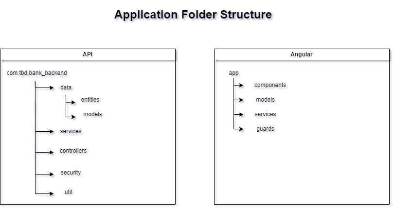
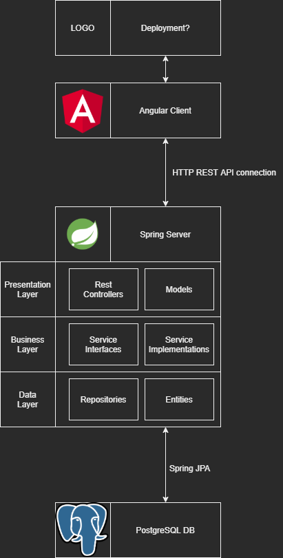
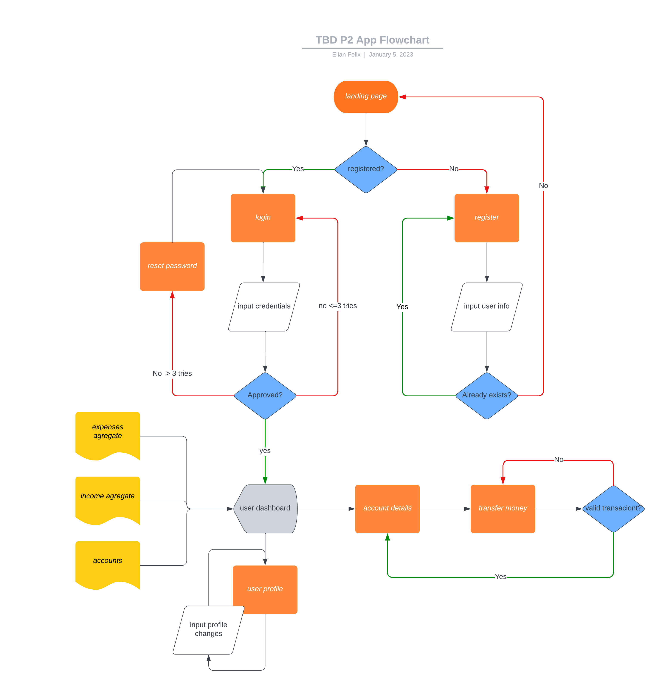
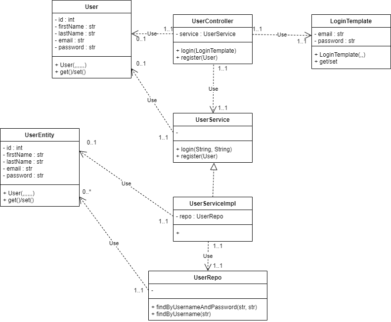
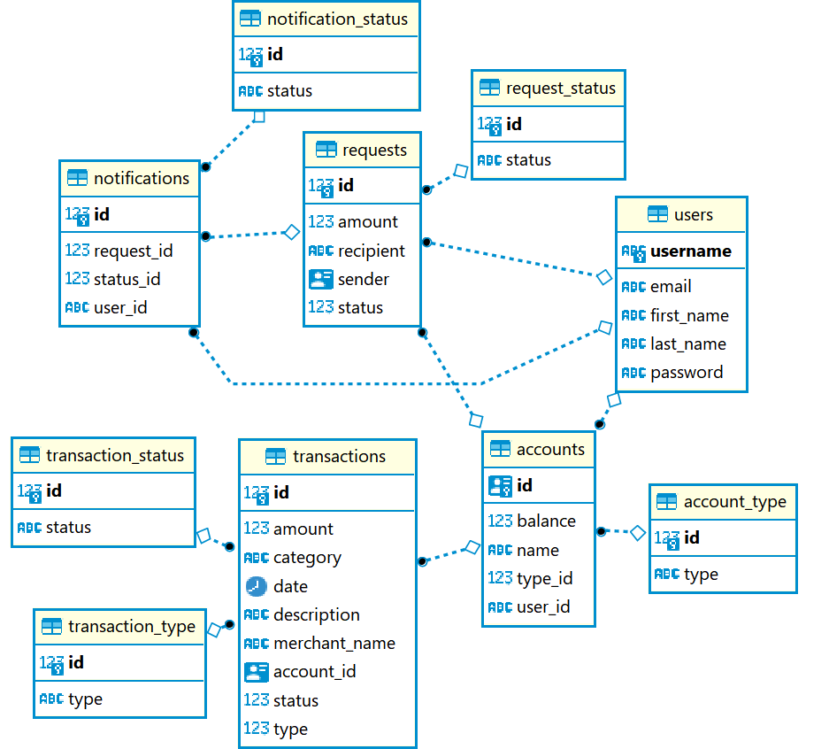
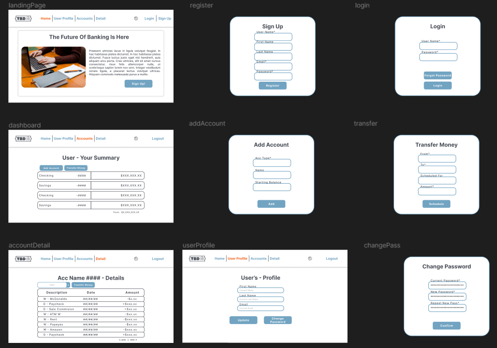
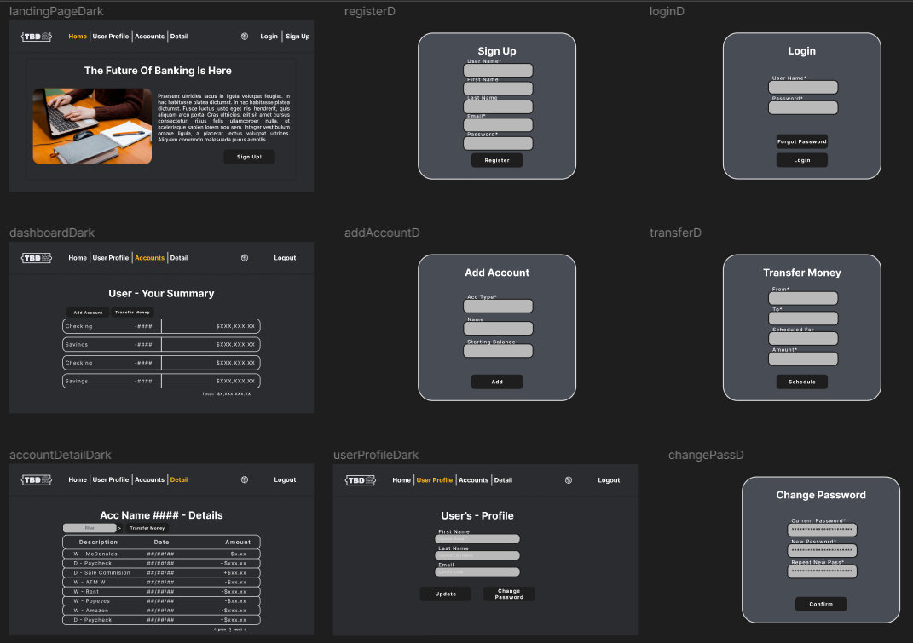

# TBD Banking Application
> TBD Bank is a banking app that offers a range of features to help users manage their finances efficiently and securely. Users can create a user account and log in to access their profile, where they can view and update their information, including the option to change their password. In addition to creating and viewing bank accounts, users can also transfer money between their own accounts and request or send money to other users. They can also view their transaction history and filter it by income or expense. Additionally, users can stay informed about incoming money requests through their notifications and easily process them as needed

---
### Project Specifications

**Structural Model** 
 

 

**Logical Model**
 

 

**Flowchart**
 

 

**User Components**
 

 

**Entity Relationship Diagram**
 

 

**Light Mode Wireframing**
 

 

**Dark Mode Wireframing**
 

 

## Tech Stack 
- [ ] Java
- [ ] Apache Maven
- [ ] PostgreSQL
- [ ] Spring Boot
- [ ] Spring Security
- [ ] Git SCM
- [ ] Postman
- [ ] TypeScript
- [ ] JUnit
- [ ] Mockito
- [ ] Angular 2+
- [ ] Bootstrap
- [ ] JWT
